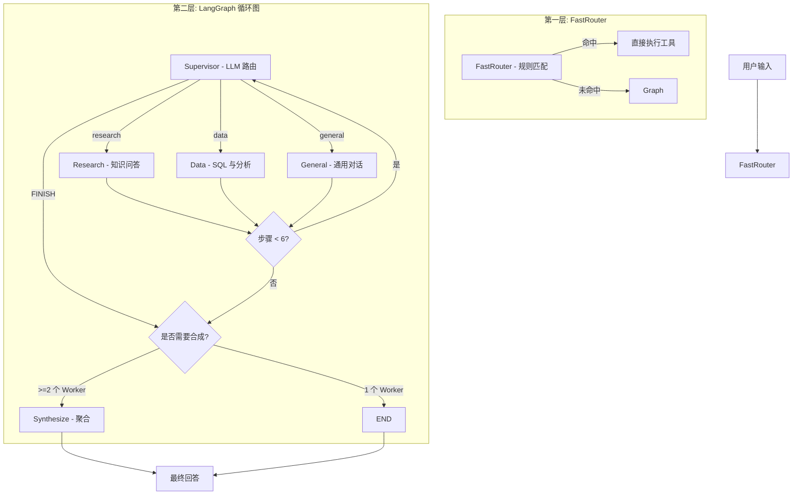

# AI Agent Assistant System — 企业级 AI 助手平台


企业级 AI Agent 平台，整合 RAG、工具调用、多租户、仪表盘与多智能体编排能力。基于 FastAPI + LangGraph + React + MySQL 构建。

## 智能体工作流架构

双层设计：FastRouter（零 LLM 直通层）+ LangGraph 循环图（带 Supervisor 循环）。



### FastRouter

纯正则规则匹配，零 LLM 调用，延迟约 1ms。覆盖天气、计算器、问候、日期时间等场景。

### LangGraph 循环图

- **Supervisor**：始终调用 LLM 做路由决策，解析失败时走启发式兜底
- **Workers**（research/data/general）：使用 `create_react_agent` 构建，实例缓存，streaming=True
- **Synthesize**：将多个 Worker 的结果聚合成最终回答
- **安全保障**：最大 6 步限制，自动检测重复路由

参考项目：[WL7749/ai-agent](https://github.com/WL7749/ai-agent)

## 快速开始

```bash
cp .env.example .env
cd backend && pip install -r requirements.txt && python main.py
cd frontend && npm install && npm run dev
```

## 技术栈

后端：FastAPI, LangGraph, SQLAlchemy, MySQL, FAISS
前端：React 19, Vite 8, React Router 7, Axios
DevOps：Docker Compose, Nginx, GitHub Actions

## 许可证：MIT
