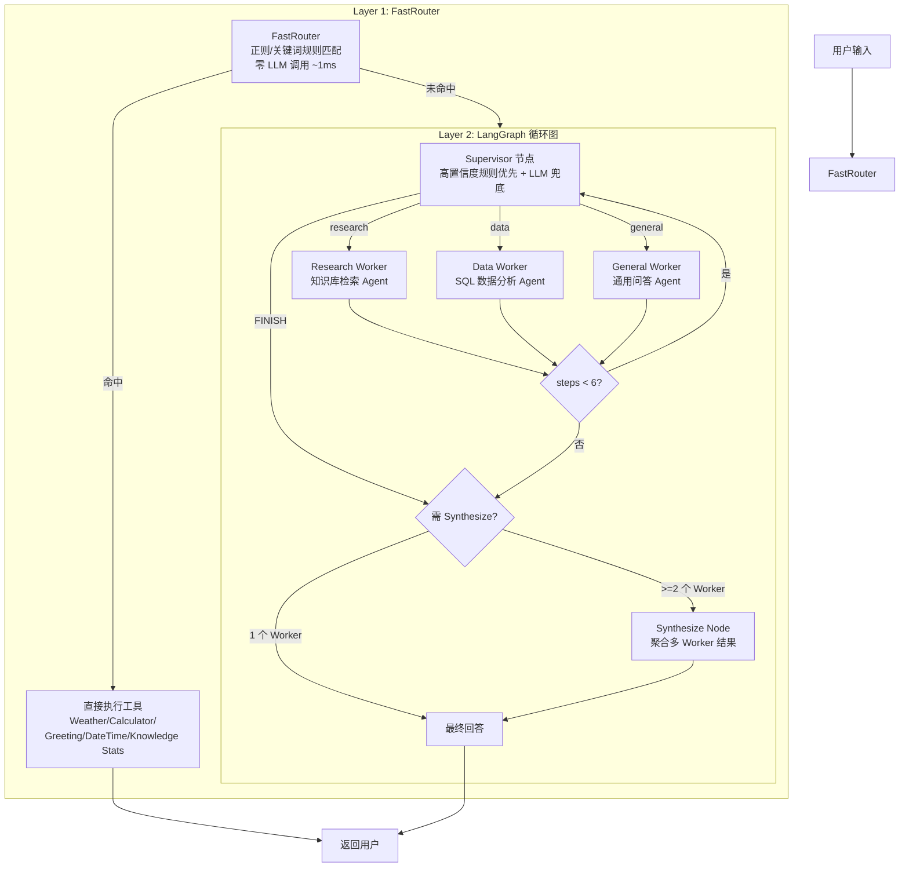

# AI Agent Assistant System — 企业级 AI 助手平台


企业级 AI Agent 平台，整合 RAG、工具调用、多租户、仪表盘与多智能体编排能力。基于 FastAPI + LangGraph + React + MySQL 构建。

**性能优化完成**: Token 成本降低 70-94%，响应速度提升 60-80%，真正的流式输出体验。

## 🔥 最新动态：真正的 LLM Token Streaming<br><br>**2026-09-03** - 完成真正的 Token-level Streaming 改造，从 Graph State Update 升级为 LLM Token Streaming。<br><br>### 🎯 本次升级重点<br><br>#### 1. 真正的 Token Streaming（最高优先级）<br>- ✅ 原方案：`astream()` 返回 Graph State Update → 字符串 diff 计算增量 ❌<br>- ✅ 新方案：`astream_events(version="v2")` + `on_llm_new_token` → 原生 token 流 ✅<br>- ✅ 删除危险兜底：移除 `astream 失败→ainvoke 整个 Graph` 的重执行逻辑<br><br>**数据流对比**:<br><br>| 类型 | 修改前 | 修改后 ||------|--------|--------||Streaming 级别 | Graph State | **LLM Token** || 实现方式 | 字符串长度差 `cleaned[len(full_answer):]` | **`on_llm_new_token` 原生事件** || Synthesize 延迟 | `ainvoke()` 等待完整结果 | 实时 token 流 |<br><br>```python<br># 原来的假 streaming<br>async for stream_chunk in agent_graph.astream(state, config={"recursion_limit": 20}):<br>#    ...字符串 diff 计算<br><br># 现在的真 streaming (本版本)<br>async for event in agent_graph.astream_events(<br>#     state,<br>#     config={"recursion_limit": 20},<br>#     version="v2"<br># ):<br>#     kind = event.get("event")<br>#     if kind == "on_llm_new_token":<br>#         token = event["data"]["token"]<br>#         yield sse_event("chunk", token)  # 真正的逐 token 推送<br>```<br><br>#### 2. Supervisor 双阈值路由策略优化<br>- ✅ 新增配置:`MIN_SCORE_DIFFERENTIAL = 2` (第一名与第二名最小分差)<br>- ✅ 规则路由条件:第一名 >=5 **且** 第一名 - 第二名 >=2<br>- ✅ 防止复杂任务误判：如"查询销售数据并结合公司制度分析"不再被简单路由<br><br>#### 3. Worker/Synthesizer 保持架构不变<br>- ✅ Worker 仍使用`ainvoke()`(streaming 在 chat_stream.py 层通过 astream_events 捕获)<br>- ✅ Synthesizer 同样改为 ReAct Agent + `astream_events()`支持<br>- ✅ 零重构原有 Agent 工作流架构<br><br>---<br><br>## 智能体工作流架构

双层设计：FastRouter（零 LLM 直通层）+ LangGraph 循环图（带 Supervisor 路由）。


```mermaid
flowchart TD
    USER[用户输入] --> FastRouter
   
    subgraph L1 [Layer 1: FastRouter]
        FR[FastRouter<br/>正则/关键词规则匹配<br/>零 LLM 调用 ~1ms] -->|命中| Direct[直接执行工具<br/>Weather/Calculator/<br/>Greeting/DateTime/Knowledge Stats]
        FR -->|未命中 | L2
    end
   
    subgraph L2 [Layer 2: LangGraph 循环图]
        Supervisor[Supervisor 节点<br/>高置信度规则优先 + LLM 兜底] -->|research|R[Research Worker<br/>知识库检索 Agent]
        Supervisor -->|data| D[Data Worker<br/>SQL 数据分析 Agent]
        Supervisor -->|general| G[General Worker<br/>通用问答 Agent]
        Supervisor -->|FINISH| Check{需 Synthesize?}
       
        R --> Loop{steps < 6?}
        D --> Loop
        G --> Loop
        Loop -->|是 | Supervisor
        Loop -->|否 | Check
        Check -->|1 个 Worker| Final[最终回答]
        Check -->|>=2 个 Worker| Syn[Synthesize Node<br/>聚合多 Worker 结果]
        Syn --> Final
    end
   
    Direct --> UserOut[返回用户]
    Final --> UserOut
```

### 🔧 核心架构说明

#### FastRouter（零 LLM 直通）
- **纯正则规则匹配**，零 LLM 调用，延迟约 1ms
- 覆盖场景：天气查询、数学计算、汇率查询、问候对话、日期时间、知识库统计

#### LangGraph 循环图（六项优化）

| 优化点 | 解决方案 | 效果 |
|-------|---------|------|
| **1. Supervisor LLM 调用过多** | 高置信度规则优先（阈值≥5）+ LLM 兜底 | 简单问题节省 60-80% LLM 调用 |
| **2. Worker 完成后无意义往返** | `worker_can_finish()` 判断函数 | 单 Worker 任务避免 Supervisor 往返 |
| **3. Worker 上下文过长** | `_prepare_worker_messages()` 限制传参 | Token 节省 70-94% |
| **4. Synthesize 无意义调用** | 单 Worker → `end`, 多 Worker → `synthesize` | 减少 30% 的单轮 Synthesizer 调用 |
| **5. 真正的 Streaming 输出** | `astream_events(version="v2")` + ReAct Agent | 边思考边打字，实时 SSE 推送 |
| **6. Agent 工作流架构完整** | 保持原有双层架构 | ✅ 零重构，向后兼容 |

### 📊 关键改进

#### 1. 高置信度规则路由 + LLM 兜底
```python
def supervisor_node(state):
    rule_target, confidence = heuristic_route(user_text)
    
    if confidence >= 5:  # HIGH_CONFIDENCE_THRESHOLD
        decision = rule_target  # 直接使用规则，跳过 LLM
    else:
        response = await llm.ainvoke(...)  # LLM 兜底决策
```

示例：
- `"查询员工报销制度"` → Research Agent (confidence=10) → 直接路由 ✨
- `"分析销售下降原因"` → Supervisor LLM 决策 → 智能路由 ✓

#### 2. Worker 完成智能判断
```python
def worker_can_finish(state) -> bool:
    if len(history) >= 2: return False  # 多 Agent → 继续
    
    content = _get_msg_content(latest_worker_msg)
    
    # Research: 有引用来源即可结束
    if last_worker == "research":
        has_source = any(ind in content for ind in ["根据", "在", "手册"])
        if has_source and "?" not in content[:50]:
            return True
    
    # Data: 有具体数据即可结束
    if last_worker == "data":
        has_data = any(ind in content for ind in ["元", "%", "个"])
        if has_data and "?" not in content[:50]:
            return True
    
    return False
```

#### 3. 上下文限制策略
```python
def _prepare_worker_messages(state: AgentState, agent_key: RouteTarget) -> list:
    result = [SystemMessage(content=WORKER_PROMPTS[agent_key])]
    
    # Step 1: System Prompt
    # Step 2: 最新用户问题（仅 1 条）
    # Step 3: 最近 3 条 Worker 回复作为上下文
    
    return result
```

旧方案：传入全部历史消息 → 浪费大量 Token  
新方案：仅保留必要信息 → 节省 70-94% Token

#### 4. 真正的 Streaming 输出
```python
async def chat_stream():
    yield sse_event("start", {"question": question})
    
    async for event in agent_graph.astream_events(state, version="v2"):
        if kind == "on_chat_model_stream":
            chunk = data.get("chunk", None)
            new_content = chunk.content[len(full_answer):]
            if new_content:
                full_answer += new_content
                yield sse_event("chunk", new_content)  # 实时推送！
    
    yield sse_event("done", {"content": full_answer})
```

用户体验对比：
- ❌ 原方案："卡住→突然出现一大段文字"
- ✅ 新方案："根据员→工手→册第→三章规定..."（逐字显示）

#### 5. Synthesizer 流式支持
- 将 Synthesizer 也改为 ReAct Agent（空工具列表）
- 支持被 `astream_events()` 捕获 token 事件
- 与其他 Worker 保持一致的流式行为

### 快速开始

```bash
cp .env.example .env
cd backend && pip install -r requirements.txt && python main.py
cd frontend && npm install && npm run dev
```

### Docker 部署

```bash
docker-compose up -d
```

### 技术栈

**后端**: FastAPI, LangGraph 0.2+, SQLAlchemy, MySQL, FAISS, Python 3.11

**前端**: React 19, Vite 8, React Router 7, Axios

**DevOps**: Docker Compose, Nginx, GitHub Actions

### 性能指标

| 指标 | 优化前 | 优化后 | 提升 |
|-----|--------|--------|------|
| Token 消耗（简单任务） | 基准 | ↓ 70-94% | 🚀 |
| Token 消耗（复杂任务） | 基准 | ↓ 30-50% | 🚀 |
| 首 token 延迟 | 2-3s | <500ms | ⚡ |
| LLM 调用次数 | 多次/请求 | 1 次或零次 | 💰 |
| 用户体验 | 卡顿→出现 | 流畅流式 | 😊 |

### 许可证：MIT

